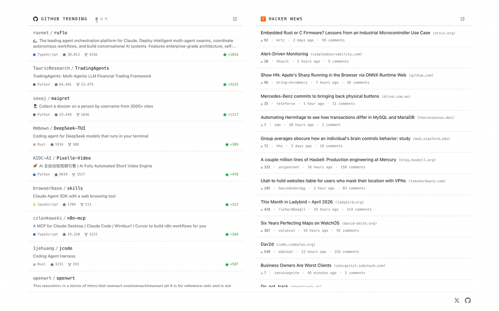

<p align="center">
	
</p>

<h1 align="center">Hackdrop</h1>

<p align="center">
	A new-tab browser extension that drops <strong>GitHub Trending</strong> and <strong>Hacker News</strong> into every new tab. Side by side, theme-aware, zero configuration.
</p>

<p align="center">
	
</p>

## Install

<p align="center">
	<a href="https://chromewebstore.google.com/detail/hackdrop/gelebdmofopcodhkeabmdebmgmehgokl">
		
	</a>
	&nbsp;
	<a href="https://addons.mozilla.org/firefox/addon/hackdrop/">
		
	</a>
</p>

Works in **Chrome, Edge, Brave, Arc, and any other Chromium browser** via the Chrome Web Store, and in **Firefox** via Mozilla Add-ons.

Prefer not to install? The same page is live at **[hackdrop.theedoran.xyz](https://hackdrop.theedoran.xyz)** — open it as your homepage, or just bookmark it.

Hacking on it? [Build from source](#build-from-source) and sideload.

## What you get

- **Two clean columns.** GitHub Trending on the left, Hacker News on the right.
- **Daily / weekly / monthly** trending. Your last choice is remembered.
- **Auto theme.** Follows your browser's `prefers-color-scheme`. No toggle, no flash on load.
- **Cross-browser.** Chromium and Firefox from a single MV3 build.
- **Fast.** Cached results render instantly, then refresh in the background.
- **Quiet.** No accounts, no settings page, no notifications.

## Privacy

Hackdrop has no analytics, no accounts, and no third-party trackers. The extension talks to a single host, `hackdrop-api.theedoran.xyz`, which proxies GitHub Trending and Hacker News so your browser never contacts those services directly. Your filter choice and a short-lived cache of the public trending lists are stored locally in `browser.storage.local`.

Full details: [`docs/PRIVACY.md`](./docs/PRIVACY.md).

## Changelog

See [`CHANGELOG.md`](./CHANGELOG.md) for what's new in each release.

## Build from source

<details>
<summary><strong>Build, run, and load the unpacked extension</strong></summary>

Requires Node 24+ and pnpm 10.x.

```bash
pnpm install
pnpm dev   # extension Vite dev server + Hono server in parallel
```

**Loading the unpacked extension:**

- **Chromium:** `pnpm --filter @hackdrop/extension build`, then load `extension/dist/` unpacked at `chrome://extensions`.
- **Firefox:** `pnpm --filter @hackdrop/extension build`, then go to `about:debugging` → *This Firefox* → *Load Temporary Add-on* → pick `extension/dist/manifest.json`.

For a signing-ready zip, run `pnpm --filter @hackdrop/extension package` (output lands in `extension/web-ext-artifacts/`).

The extension calls a small Hono server at `https://hackdrop-api.theedoran.xyz` for both GitHub Trending and Hacker News data. To self-host, see [`server/DEPLOYMENT.md`](./server/DEPLOYMENT.md). To publish the extension to a store, see [`extension/DEPLOYMENT.md`](./extension/DEPLOYMENT.md).

</details>

## Credits

Hackdrop is heavily inspired by the wonderful [Devo](https://github.com/karakanb/devo) extension; all credit to its author for the original idea and design language. Hackdrop is a from-scratch reimplementation with a different content mix and a server-side scraper for trending data.

## License

[MIT](./LICENSE).
